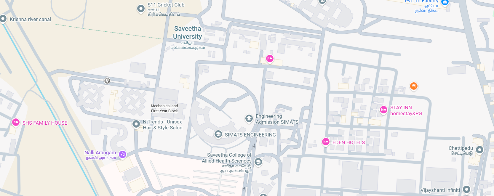

# Ex04 Places Around Me
## Date: 

## AIM
To develop a website to display details about the places around my house.

## DESIGN STEPS

### STEP 1
Create a Django admin interface.

### STEP 2
Download your city map from Google.

### STEP 3
Using ```<map>``` tag name the map.

### STEP 4
Create clickable regions in the image using ```<area>``` tag.

### STEP 5
Write HTML programs for all the regions identified.

### STEP 6
Execute the programs and publish them.

## CODE
```
<!DOCTYPE html>
<html lang="en">
<head>
    <meta charset="UTF-8">
    <meta name="viewport" content="width=device-width, initial-scale=1.0">
    <title>homepage</title>
</head>
<body>
    <!-- Image Map Generated by http://www.image-map.net/ -->


<map name="image-map">
    <area target="" alt="engineering" title="engineering" href="simats.html" coords="1053,498,616,317" shape="rect">
    <area target="" alt="university" title="university" href="saveetha.html" coords="631,112,194" shape="circle">
    <area target="" alt="krishna" title="krishna" href="river.html" coords="1,0,122,29,190,72,197,174,165,219,140,288,103,319,68,328,51,324,6,324" shape="poly">
</map>
</body>
</html>

<!DOCTYPE html>
<html lang="en">
<head>
    <meta charset="UTF-8">
    <meta name="viewport" content="width=device-width, initial-scale=1.0">
    <title>Document</title>
</head>
<body bgcolor="cyan" text="red">
    
    <p>The Krishna River is one of the major rivers of South India, known for its cultural, historical, and agricultural importance.

🌊 Basic Facts

Length: About 1,400 km

Origin: Mahabaleshwar, in the Western Ghats, Maharashtra

Flows Through:

Maharashtra

Karnataka

Telangana

Andhra Pradesh

End Point: Empties into the Bay of Bengal near Hamsaladeevi (AP)

🏞️ Major Tributaries

Left-bank: Bhima, Dindi, Munneru

Right-bank: Tungabhadra, Ghataprabha, Malaprabha

🚧 Important Dams & Projects

Nagarjuna Sagar Dam (AP & Telangana)

Srisailam Dam (AP & Telangana)

Almatti Dam (Karnataka)

Krishna Barrage / Prakasam Barrage (Vijayawada, AP)

🌾 Importance

One of India’s major rivers supporting irrigation and agriculture in the Deccan plateau.

Vital for rice, cotton, sugarcane, and chilli cultivation.

Supports power generation and drinking water supply in multiple states.

🏛️ Cultural Significance

River is sacred in Hindu traditions.

Krishna Pushkaralu festival is celebrated once every 12 years.

If you want, I can also provide a map, history, or short notes for exams about the Krishna River.

ChatGPT c</p>
    
</body>
</html>

<!DOCTYPE html>
<html lang="en">
<head>
    <meta charset="UTF-8">
    <meta name="viewport" content="width=device-width, initial-scale=1.0">
    <title>saveetha</title>
</head>
<body bgcolor="cyan" text="red">
    
    <p>SIMATS Engineering refers to the Saveetha School of Engineering, the engineering division of Saveetha Institute of Medical and Technical Sciences (SIMATS) — a deemed-to-be-university located in Chennai, Tamil Nadu, India. 
SIMATS ENGINEERING
+1

📍 Overview

Saveetha School of Engineering (SIMATS Engineering)

Constituent engineering college of SIMATS focused on technical education, research, and innovation. 
Simat VLSI

Aims to develop competent professionals with strong theoretical and practical skills. 
</p>
</body>
</html>
```
## OUTPUT
 
 
 


## RESULT
The program for implementing image maps using HTML is executed successfully.
